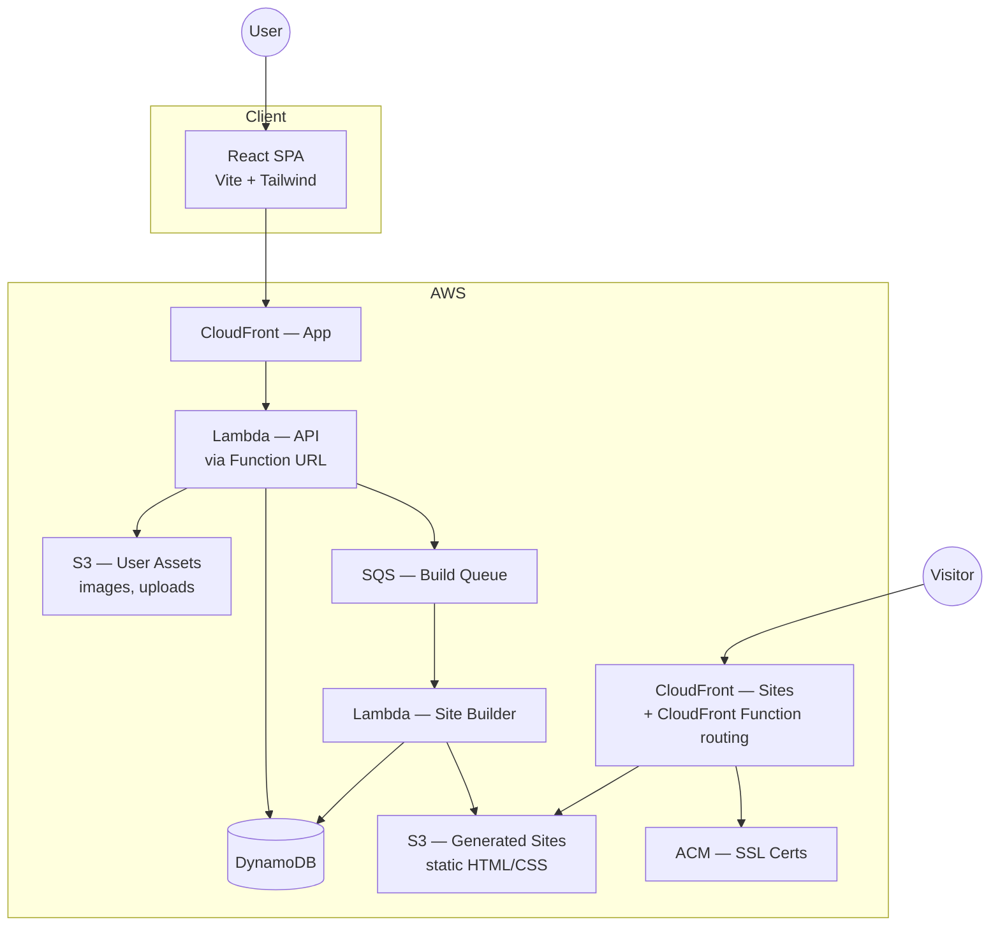
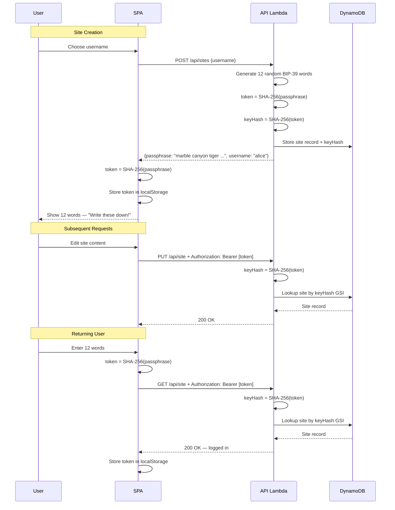
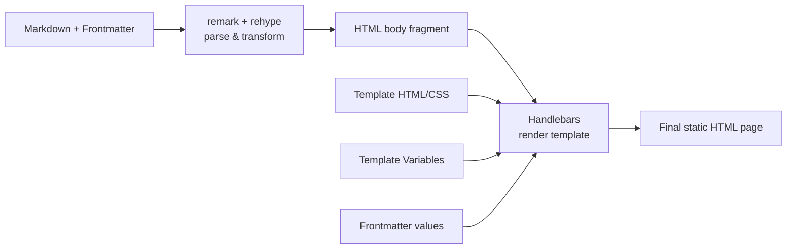
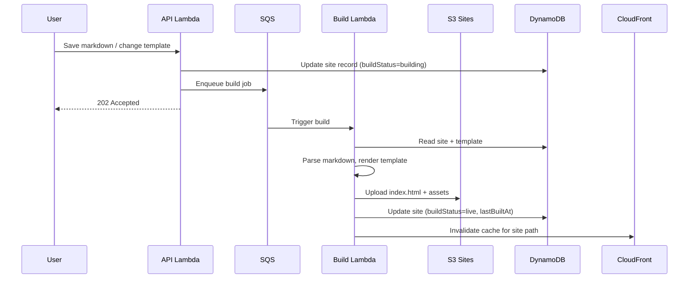
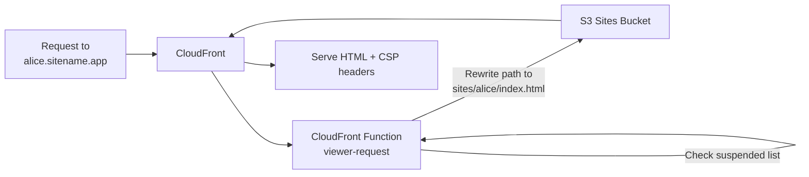
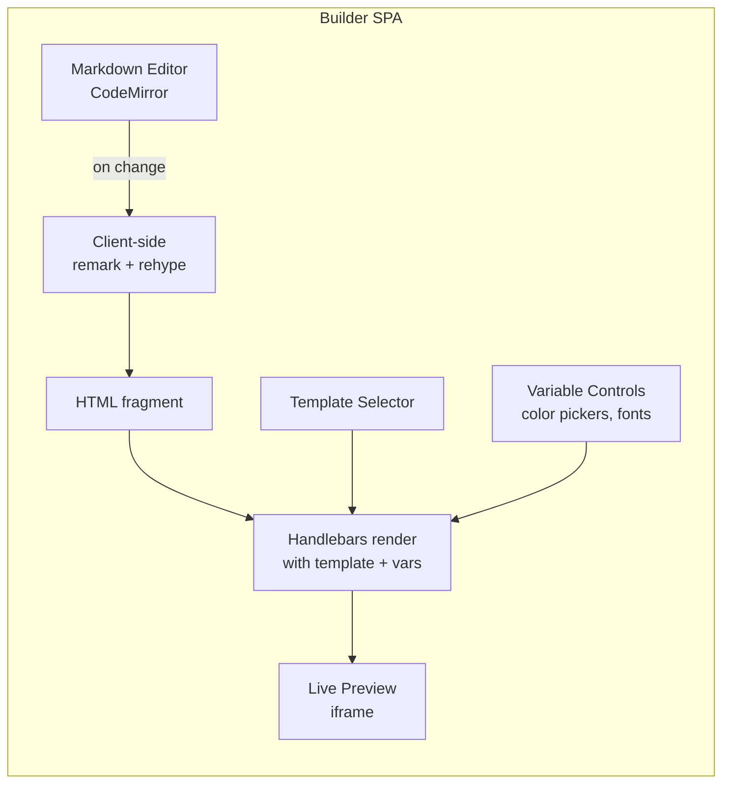
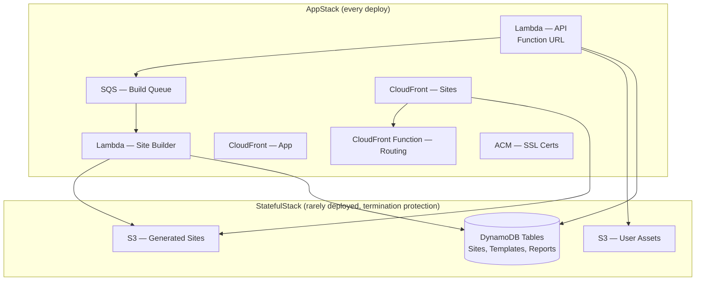
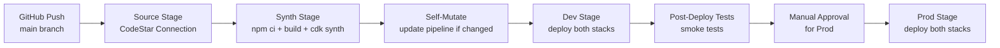

# Design

## System Overview

A free, managed personal-site platform. Users write markdown, pick a template, and get a fast static site hosted on a CDN with a subdomain or custom domain. A theme marketplace lets users discover and share templates. A live builder provides real-time editing and theming.

## Architecture



## Authentication

12-word mnemonic passphrase auth. No OAuth, no passwords, no third-party providers, no managed auth service.

### How It Works

When a user creates a site, they pick a username. The API generates 12 cryptographically random words from the [BIP-39 wordlist](https://github.com/bitcoin/bips/blob/master/bip-0039/english.txt) (2048 words, 12 words = 128 bits of entropy). The passphrase is returned **once** in the creation response.

We store only a SHA-256 hash of the passphrase. 128 bits of entropy makes brute-force infeasible even against a fast hash — no need for a slow KDF like PBKDF2/scrypt.

**Token derivation:** The client SHA-256 hashes the passphrase locally to produce a hex token. This token (not the raw passphrase) is sent as `Authorization: Bearer <token>` and stored in `localStorage`. The server SHA-256 hashes the token again to get the `keyHash` for DB lookup. This double-hash ensures the passphrase never leaves the client in plaintext, and a DB leak of `keyHash` values cannot be reversed to the token or passphrase.

```
passphrase: "marble canyon tiger hollow drift ember socket plume anchor frost violet dawn"
     ↓ SHA-256 (client-side)
token: "a9f3e2..." (sent as Bearer token, stored in localStorage)
     ↓ SHA-256 (server-side)
keyHash: "7c1d8b..." (stored in DynamoDB)
```



### Passphrase Management

- Client stores the derived token (not the raw passphrase) in `localStorage`
- User is shown the 12 words once at creation and prompted to write them down
- "Returning user" flow: enter your 12 words → client derives token → validates against API → stored in `localStorage`
- Passphrase regeneration: generates new 12 words (requires current auth). Old passphrase is immediately invalidated
- **Lost passphrase = lost access.** No recovery mechanism. Acceptable trade-off for zero-dependency auth on a free service. Made very clear at creation time.

### Why This Is Secure

- **128 bits of entropy**: 12 BIP-39 words = 2048^12 ≈ 2^132 combinations. Brute-force is not feasible.
- **Double-hash storage**: DB stores `SHA-256(SHA-256(passphrase))`. A leaked DB gives the attacker neither the token nor the passphrase.
- **Token never exposes passphrase**: Even if `localStorage` is compromised, the attacker gets the token (can use the API) but cannot recover the original 12 words. User can regenerate from another device where they have the words written down.
- **No third-party trust**: Auth depends only on math, not on Google/GitHub uptime or security.
- **Transport security**: All traffic over HTTPS. Passphrase only transmitted once (at creation, server→client). After that, only the derived token is sent.

## Data Models

### Site

The site is the primary entity — there is no separate "user" table. One site = one identity.

| Field        | Type   | Description                                            |
| ------------ | ------ | ------------------------------------------------------ |
| siteId       | String | ULID (PK)                                              |
| username     | String | Unique, URL-safe (GSI)                                 |
| keyHash      | String | SHA-256(SHA-256(passphrase)) — double-hashed (GSI for auth lookups) |
| displayName  | String | Optional display name                                  |
| markdown     | String | Raw markdown content (or S3 pointer for large content) |
| frontmatter  | Map    | Parsed YAML frontmatter                                |
| templateId   | String | Currently active template                              |
| templateVars | Map    | Current template variable values                       |
| customDomain | String | Optional custom domain                                 |
| buildStatus  | String | `draft` / `building` / `live` / `failed`               |
| lastBuiltAt  | String | ISO timestamp                                          |
| siteUrl      | String | Generated site URL                                     |
| createdAt    | String | ISO timestamp                                          |
| updatedAt    | String | ISO timestamp                                          |

### Template

| Field         | Type   | Description                        |
| ------------- | ------ | ---------------------------------- |
| templateId    | String | ULID (PK)                          |
| authorSiteId  | String | Creator's siteId (GSI)             |
| name          | String | Display name                       |
| slug          | String | URL-safe identifier (GSI, unique)  |
| description   | String | Short description                  |
| html          | String | Handlebars HTML template           |
| css           | String | Template CSS                       |
| variables     | List   | Variable definitions (name, type, default, label) |
| previewImage  | String | S3 URL of auto-generated preview   |
| usageCount    | Number | Number of sites using this         |
| isCurated     | Bool   | Platform-provided template flag    |
| forkedFromId  | String | Source template if forked           |
| createdAt     | String | ISO timestamp                      |
| updatedAt     | String | ISO timestamp                      |

### Template Variable Definition

```json
{
  "name": "primaryColor",
  "label": "Primary Color",
  "type": "color",
  "default": "#2563eb"
}
```

Supported variable types: `color`, `font`, `number`, `select`, `text`.

## Template Engine

Templates are HTML + CSS using [Handlebars](https://handlebarsjs.com/) syntax. The markdown-to-HTML pipeline:



The Handlebars template receives:

- `{{content}}` — the rendered markdown HTML
- `{{title}}`, `{{description}}`, `{{ogImage}}` — from frontmatter
- `{{vars.primaryColor}}`, `{{vars.fontFamily}}`, etc. — user-set variables
- `{{site.username}}`, `{{site.url}}` — site metadata

Example template snippet:

```html
<!DOCTYPE html>
<html lang="en">
<head>
  <meta charset="UTF-8">
  <title>{{title}}</title>
  <meta name="description" content="{{description}}">
  <meta property="og:title" content="{{title}}">
  <meta property="og:image" content="{{ogImage}}">
  <style>
    :root {
      --primary: {{vars.primaryColor}};
      --font: {{vars.fontFamily}};
    }
    /* ... rest of template CSS ... */
  </style>
</head>
<body>
  <main>{{{content}}}</main>
</body>
</html>
```

## Site Build Pipeline

Site generation is async. When a user saves content or changes their template, a message is pushed to SQS. A Lambda consumer picks it up, renders the static HTML, and uploads to S3.



Build Lambda steps:
1. Fetch markdown, template, and variables from DB
2. Parse frontmatter with `gray-matter`
3. Convert markdown to HTML via `unified` + `remark-parse` + `remark-gfm` + `remark-math` + `rehype-stringify` + `rehype-highlight` + `rehype-katex`
4. **Sanitize markdown HTML** via `rehype-sanitize` (strip any raw HTML injection)
5. **Sanitize template** — strip `<script>`, inline event handlers, `<form>`, `<iframe>`, `<embed>`, `<object>`, `javascript:` URIs
6. Render Handlebars template with content + variables
7. **Inject security headers** into the HTML: CSP meta tag as fallback
8. Upload to S3 at path `sites/{username}/index.html` with response headers: `Content-Security-Policy: script-src 'none'; frame-ancestors 'none'`
9. Invalidate CloudFront cache for `{username}.{domain}/*`

The server-side build is the **security control point**. Even though the client-side preview uses the same render lib, the final HTML that reaches S3 is always sanitized server-side. Users can preview anything in the builder, but only clean output gets published.

## Content Security

### Defense Layers

```mermaid
flowchart TD
    subgraph "Build Time (Lambda)"
        MD_SAN[rehype-sanitize<br/>on markdown HTML]
        TMPL_SAN[Template sanitizer<br/>strip script/form/iframe/events]
        CSP_INJ[Inject CSP meta tag<br/>as fallback]
    end

    subgraph "Serve Time (CloudFront)"
        CSP[Response header<br/>script-src none]
        FRAME[Response header<br/>frame-ancestors none]
        SUSPEND[CloudFront Function<br/>checks suspended flag]
    end

    subgraph "Ongoing"
        REPORT[Report abuse link<br/>on every site]
        SAFEBROWSE[Google Safe Browsing<br/>periodic scan]
        RATELIMIT[Site creation<br/>rate limit per IP]
    end

    MD_SAN --> TMPL_SAN --> CSP_INJ
    CSP --> FRAME --> SUSPEND
    REPORT --> SAFEBROWSE --> RATELIMIT
```



### Template Sanitization

Templates are sanitized server-side during build. Allowed: all standard HTML elements, CSS, Handlebars expressions. Stripped:

| Blocked | Why |
|---------|-----|
| `<script>`, `<noscript>` | No JS execution on hosted sites |
| Inline event handlers (`onclick`, `onerror`, etc.) | JS execution backdoor |
| `<form>` | Credential harvesting / phishing |
| `<iframe>`, `<embed>`, `<object>` | Third-party content injection |
| `javascript:` URIs | JS execution via links |
| `<meta http-equiv="refresh">` | Redirect-based phishing |

### CSP as Backstop

Even if sanitization misses something, the `Content-Security-Policy: script-src 'none'` response header on all hosted sites blocks JS execution at browser level. This is set via CloudFront response headers policy — cannot be overridden by site content.

### Abuse Reporting & Takedown

- Every hosted site footer includes a small "Report this site" link (injected at build time)
- Reports stored in DynamoDB `Reports` table (siteId, reason, reporterIP, timestamp)
- Notification via SNS → email on new reports
- Suspended sites: `suspended` flag on site record. CloudFront Function checks a cached suspension list and returns HTTP 451 for suspended sites
- Manual review initially — automated at scale if needed

### Google Safe Browsing Integration

- Scheduled Lambda (daily) checks all active site URLs against Google Safe Browsing Lookup API (free, 10k lookups/day)
- Auto-suspends any flagged site
- Sends notification for manual review

## Hosting & Domain Architecture

### Subdomain Routing

All user sites are served from a single S3 bucket via a single CloudFront distribution. A CloudFront Function (viewer-request) routes based on the `Host` header:



CloudFront Functions instead of Lambda@Edge — 6x cheaper ($0.10/M vs $0.60/M), faster (sub-ms), sufficient for simple host-header routing + suspension checks.

A wildcard DNS record `*.sitename.app` points to the CloudFront distribution. A wildcard ACM certificate covers all subdomains.

### Custom Domains

For custom domains:
1. User adds their domain in the app
2. App displays DNS instructions: create a CNAME record pointing to the CloudFront distribution
3. CloudFront Function looks up the custom domain in a cached mapping and resolves it to the correct username
4. ACM certificate is provisioned for the custom domain (automated via Lambda that calls ACM API with DNS validation)

Custom domain mapping is stored in DynamoDB but cached as a JSON file in S3 that the CloudFront Function reads (CloudFront Functions can't call DynamoDB directly). A Lambda updates this cache file when domains are added/removed.

Custom domain flow:
1. User enters domain in app
2. API stores domain mapping + generates ACM cert request
3. App shows user the CNAME + DNS validation records to add
4. Background Lambda polls for DNS validation completion
5. Once validated, cert is attached to CloudFront distribution
6. Lambda updates domain mapping cache in S3
7. Site is now accessible via custom domain over HTTPS

## Live Preview Builder

The builder runs entirely client-side. No server round-trips for preview — markdown parsing + template rendering happens in the browser.



Key details:
- Editor uses CodeMirror 6 with markdown syntax highlighting
- Preview renders in a sandboxed iframe for style isolation
- Template switching is instant — templates are fetched and cached client-side
- Variable controls are auto-generated from the template's variable definitions
- Viewport toggle (desktop/tablet/mobile) resizes the iframe
- Same rendering pipeline is used both client-side (builder) and server-side (build Lambda) to ensure parity — shared as an npm package

## Theme Marketplace

A section of the app where users browse all public templates.

**Discovery:**
- Grid of template cards with preview thumbnails
- Search by name/description
- Filter: curated, community, most-used, newest
- Sort: popular, newest, alphabetical

**Template Detail Page:**
- Full rendered preview with sample markdown
- Variable controls to try different configurations
- Author info
- "Use this template" button (applies to your site)
- "Fork this template" button (copies to your template editor)
- Usage count

**Template Editor:**
- CodeMirror for HTML/CSS editing
- Variable definition UI (add/remove/edit variables)
- Live preview with sample markdown
- Publish button (makes template available in marketplace)

## API Design

Single Lambda with a Function URL, fronted by CloudFront for caching + custom domain. Lambda handles route dispatching internally.

| Method | Path                          | Auth | Description                      |
| ------ | ----------------------------- | ---- | -------------------------------- |
| POST   | /api/sites                    | No   | Create a new site (returns 12-word passphrase) |
| GET    | /api/site                     | Yes  | Get own site data                |
| PUT    | /api/site                     | Yes  | Update site markdown + settings  |
| DELETE | /api/site                     | Yes  | Delete site and all data         |
| POST   | /api/site/publish             | Yes  | Trigger a site build             |
| POST   | /api/site/regenerate-passphrase | Yes  | Generate new 12-word passphrase  |
| GET    | /api/templates                | No   | List/search templates            |
| GET    | /api/templates/:slug          | No   | Get template detail              |
| POST   | /api/templates                | Yes  | Create a new template            |
| PUT    | /api/templates/:id            | Yes  | Update own template              |
| DELETE | /api/templates/:id            | Yes  | Delete own template              |
| POST   | /api/templates/:id/fork       | Yes  | Fork a template                  |
| POST   | /api/domain                   | Yes  | Add custom domain                |
| GET    | /api/domain/status            | Yes  | Check domain DNS/cert status     |
| DELETE | /api/domain                   | Yes  | Remove custom domain             |
| POST   | /api/images                   | Yes  | Upload image (returns CDN URL)   |

Auth = `Authorization: Bearer <token>` header, where token is the client-side SHA-256 of the passphrase. The API Lambda SHA-256 hashes the token and looks up the site by `keyHash` GSI.

## CDK Architecture

### Project Structure

```
infra/
├── bin/
│   └── app.ts                    # App entry point — composition only
├── lib/
│   ├── stacks/
│   │   ├── stateful-stack.ts     # DynamoDB, S3 (rarely changes, termination protection)
│   │   └── app-stack.ts          # Lambda, CloudFront, SQS, CloudFront Functions (every deploy)
│   ├── constructs/               # Custom L2/L3 constructs (e.g. SecureBucket, SiteBuilder)
│   ├── stages/
│   │   └── app-stage.ts          # cdk.Stage subclass grouping both stacks
│   └── pipeline-stack.ts         # CDK Pipelines — self-mutating CodePipeline
├── config/
│   ├── types.ts                  # Shared EnvironmentConfig interface
│   ├── dev.ts
│   └── prod.ts
├── test/                         # Mirrors lib/ structure
└── cdk.json
```

### Stack Separation — Stateful vs Stateless

Two-stack pattern, split by rate of change:



Cross-stack surface kept small — AppStack receives typed props:

```typescript
interface AppStackProps extends cdk.StackProps {
  sitesTable: dynamodb.Table;
  templatesTable: dynamodb.Table;
  reportsTable: dynamodb.Table;
  assetsBucket: s3.Bucket;
  sitesBucket: s3.Bucket;
}
```

### CDK Pipelines — Self-Mutating CodePipeline

Pipeline lives in its own stack. Uses `CodePipelineSource.connection()` (AWS CodeStar connection to GitHub — not OAuth tokens). Self-mutating: pipeline updates itself when infra code changes.



```typescript
// lib/pipeline-stack.ts (simplified)
const pipeline = new CodePipeline(this, 'Pipeline', {
  pipelineName: 'SitePlatformPipeline',
  synth: new ShellStep('Synth', {
    input: CodePipelineSource.connection('owner/repo', 'main', {
      connectionArn: config.codestarConnectionArn,
    }),
    commands: [
      'npm ci',
      'npm run build',
      'npm run test',
      'npx cdk synth',
    ],
  }),
});

// Dev stage — auto-deploy
const dev = pipeline.addStage(new AppStage(this, 'Dev', { env: devEnv, config: devConfig }));
dev.addPost(new ShellStep('SmokeTest', {
  commands: ['curl -f $API_URL/health'],
  envFromCfnOutputs: { API_URL: dev.apiUrlOutput },
}));

// Prod stage — manual approval gate
pipeline.addStage(new AppStage(this, 'Prod', { env: prodEnv, config: prodConfig }), {
  pre: [new ManualApprovalStep('PromoteToProd')],
});
```

### CDK Conventions

- **`NodejsFunction`** (esbuild) for all Lambda bundling — fast, tree-shaken
- **`cdk-nag`** (`AwsSolutionsChecks`) applied at app level via Aspects
- **No hardcoded physical names** — let CloudFormation generate them
- **Config in TypeScript files** (`config/dev.ts`, `config/prod.ts`), secrets in SSM Parameter Store
- **`cdk.context.json`** committed to source control
- **SWC transpiler** for fast synth (`"ts-node": { "swc": true }`)
- **Grant methods** over manual IAM PolicyStatements
- **Construct IDs** in PascalCase, explicit `stackName` in kebab-case

## Key Technology Choices

| Concern            | Choice                          | Rationale                                                    |
| ------------------ | ------------------------------- | ------------------------------------------------------------ |
| Frontend           | React + Vite + Tailwind + shadcn/ui | Fast dev, good DX, consistent design system, accessible components |
| Infrastructure     | AWS CDK (TypeScript)            | IaC, user preference, native AWS integration                 |
| CI/CD              | CDK Pipelines (CodePipeline)    | Self-mutating, infra-as-code pipeline, all in AWS            |
| Auth               | 12-word passphrase (double SHA-256) | 128-bit entropy, zero dependencies, human-friendly backup    |
| API                | Lambda Function URL + CloudFront | Function URLs are free (pay only Lambda compute), no API Gateway cost |
| Database           | DynamoDB                        | Serverless, pay-per-use, free tier (25GB + 25 WCU/RCU)      |
| Static hosting     | S3 + CloudFront                 | Cheap, fast, global edge                                     |
| Build queue        | SQS + Lambda                    | Decoupled, auto-scaling, cheap                               |
| Edge routing       | CloudFront Functions            | 6x cheaper than Lambda@Edge, sub-ms latency, sufficient for host-header routing |
| Markdown           | unified/remark/rehype           | Extensible, CommonMark-compliant, runs in browser + Node     |
| Templates          | Handlebars                      | Simple, logic-less, safe for user-authored templates         |
| Code editor        | CodeMirror 6                    | Lightweight, extensible, good mobile support                 |
| SSL                | ACM                             | Free, auto-renewing, integrates with CloudFront              |
| Image uploads      | S3 + presigned URLs             | Direct upload, no Lambda bandwidth cost                      |
| Lambda bundling    | NodejsFunction (esbuild)        | Fast builds, tree-shaking, TypeScript native                 |
| Compliance         | cdk-nag (AwsSolutionsChecks)    | Automated security/compliance validation at synth time       |
| Shared render lib  | Internal npm package            | Ensures builder preview matches final build output           |

## Caching Strategy

Generated sites are static and change infrequently (only on publish). Aggressive caching:

- **CloudFront TTL**: `Cache-Control: public, max-age=86400, stale-while-revalidate=3600` (24h cache, serve stale for 1h while revalidating)
- **On publish**: CloudFront invalidation for `sites/{username}/*` (first 1000/month free, $0.005/path after)
- **User assets (images)**: immutable content-addressed paths (`assets/{hash}.{ext}`), `Cache-Control: public, max-age=31536000, immutable`
- **Template API responses**: short cache (5min) via CloudFront for marketplace browsing

Most visitor traffic served entirely from CloudFront edge — never hits S3 origin.

## Cost Estimation (Low Traffic)

At low-to-moderate usage (few thousand users), monthly costs dominated by free tiers:

| Service | Cost | Notes |
|---------|------|-------|
| Auth | $0 | Self-managed passphrase hashing |
| Lambda Function URLs | $0 | No per-request charge (only Lambda compute) |
| Lambda compute | $0 | Free tier: 1M requests + 400k GB-seconds |
| DynamoDB | $0 | Free tier: 25GB + 25 RCU/WCU |
| S3 | ~$0.50 | Storage for sites + assets |
| CloudFront | $0 | 1TB free transfer/month |
| CloudFront Functions | ~$0.10 | $0.10/million invocations |
| SQS | $0 | Free tier: 1M requests |
| ACM | $0 | Free certs |
| SNS (abuse alerts) | $0 | Free tier covers low volume |
| CodePipeline | $1 | $1/active pipeline/month |
| CodeBuild | ~$0.50 | Build minutes for deploys |

**Estimated: ~$2/month at launch scale.** Key savings vs original design:
- Lambda Function URLs eliminate API Gateway ($3.50/M requests → $0)
- CloudFront Functions replace Lambda@Edge ($0.60/M → $0.10/M)
- Aggressive caching minimizes origin requests
