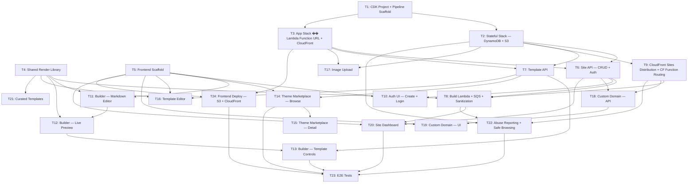

# Plan

## Task Dependency Graph

## Parallelization Groups

| Phase | Tasks | Depends On |
|-------|-------|------------|
| 0 | T1, T4, T5 | Nothing — start immediately |
| 1 | T2, T3 | T1 |
| 2 | T6, T7, T9, T10, T11, T17, T24 | Phase 1 + T4/T5 as needed |
| 3 | T8, T12, T13, T14, T16, T18, T21, T22 | Phase 2 |
| 4 | T15, T19, T20 | Phase 3 |
| 5 | T23 | Phase 4 |

## Tasks

### Phase 0 — Foundations (parallel)

- [x] **T1: CDK Project + Pipeline Scaffold**
  Set up CDK app with TypeScript. Project structure per CDK best practices:
  - `bin/app.ts` — composition only, instantiate pipeline stack
  - `lib/stacks/` — `StatefulStack`, `AppStack`
  - `lib/stages/app-stage.ts` — `cdk.Stage` subclass grouping both stacks
  - `lib/pipeline-stack.ts` — CDK Pipelines self-mutating CodePipeline
  - `config/` — typed `EnvironmentConfig` interface + `dev.ts`, `prod.ts` configs
  
  Pipeline setup:
  - `CodePipelineSource.connection()` from GitHub via CodeStar connection
  - Synth step: `npm ci`, `npm run build`, `npm run test`, `npx cdk synth`
  - Dev stage: auto-deploy + post-deploy smoke test
  - Prod stage: `ManualApprovalStep` gate before deploy
  - Self-mutation enabled (pipeline updates itself)
  
  CDK configuration:
  - SWC transpiler (`"ts-node": { "swc": true }`)
  - `cdk-nag` (`AwsSolutionsChecks`) applied via Aspects at app level
  - `cdk.context.json` committed to source control
  - `"aws:cdk:disable-stack-trace": true` in `cdk.json`

- [x] **T4: Shared Render Library**
  Create internal package (`@site/renderer`) that converts markdown + template + variables into final HTML. Uses `unified` + `remark-parse` + `remark-gfm` + `remark-math` + `rehype-stringify` + `rehype-highlight` + `rehype-katex` + `gray-matter` + `handlebars`. Must work in both Node.js (Lambda) and browser. Include `rehype-sanitize` for server-side use. Include unit tests for rendering edge cases.

- [x] **T5: Frontend Scaffold**
  Init React + Vite + Tailwind + shadcn/ui + TypeScript app. Set up shadcn/ui (init, configure theme, install core components: Button, Input, Card, Dialog, Tabs, Select, DropdownMenu, Toast). Set up routing (React Router), layout shell (nav, sidebar), Tailwind config, and basic pages (home, create, login, dashboard, builder, marketplace). Auth context that stores derived token in `localStorage`. No real functionality yet — just the skeleton and navigation.

### Phase 1 — Infrastructure (parallel, needs T1)

- [x] **T2: Stateful Stack — DynamoDB + S3**
  `StatefulStack` with termination protection enabled. Define:
  - DynamoDB `Sites` table (PK: siteId, GSIs: username, keyHash) — on-demand billing
  - DynamoDB `Templates` table (PK: templateId, GSIs: authorSiteId, slug) — on-demand billing
  - DynamoDB `Reports` table (PK: reportId, GSI: siteId) — on-demand billing
  - S3 bucket for user assets (images)
  - S3 bucket for generated sites
  
  Export table/bucket references via typed props interface for AppStack consumption. No hardcoded physical names — let CloudFormation generate.

- [x] **T3: App Stack — Lambda Function URL + CloudFront**
  `AppStack` receives stateful resources via typed props. Define:
  - API Lambda (`NodejsFunction` with esbuild) + Function URL (no API Gateway)
  - CloudFront distribution for API (Function URL as origin, custom domain)
  - Build Lambda (`NodejsFunction`) + SQS queue + DLQ
  - SNS topic for abuse report notifications
  - EventBridge scheduled rule for daily Safe Browsing scan Lambda
  - IAM via `grant*` methods (not manual PolicyStatements)
  - CORS, rate limiting configuration
  
  Output API URL as CfnOutput for pipeline smoke tests.

### Phase 2 — Core APIs & Early UI (parallel, needs Phase 1)

- [x] **T6: Site API — CRUD + Auth**
  Implement endpoints: `POST /api/sites` (create site — generate 12 BIP-39 words, compute double SHA-256 hash, store `keyHash`, return passphrase once), `GET /api/site`, `PUT /api/site`, `DELETE /api/site`, `POST /api/site/publish`, `POST /api/site/regenerate-passphrase`. Username validation (URL-safe, unique, not reserved). Delete cascades to templates + S3 assets. Include BIP-39 English wordlist as static asset. Rate limit site creation: 5 per IP per hour.

- [x] **T7: Template API**
  Implement endpoints: `GET /api/templates` (search, filter, sort, paginate), `GET /api/templates/:slug`, `POST /api/templates`, `PUT /api/templates/:id`, `DELETE /api/templates/:id`, `POST /api/templates/:id/fork`. Validate template HTML/CSS.

- [x] **T9: CloudFront Sites Distribution + CF Function Routing**
  Add to AppStack: CloudFront distribution for user sites with OAC to S3 sites bucket. Configure wildcard DNS (`*.sitename.app`) + wildcard ACM cert. CloudFront response headers policy: `Content-Security-Policy: script-src 'none'; frame-ancestors 'none'`. Aggressive cache TTLs (24h for sites, immutable for assets). CloudFront Function (viewer-request) for host-header routing — extracts username from subdomain, rewrites S3 path. Checks suspension list (cached JSON in S3) — returns HTTP 451 for suspended sites. Reads domain mapping JSON for custom domain resolution.

- [x] **T10: Auth UI — Create + Login**
  Create site flow: pick username → call API → display 12-word passphrase with prominent "write these down" warning + copy button. Client SHA-256 hashes passphrase to derive token, stores token in `localStorage`. Return flow: enter 12 words → client derives token → validate against API → store in `localStorage`. Passphrase regeneration UI (shows new 12 words). Logout = clear `localStorage`.

- [x] **T11: Builder — Markdown Editor**
  CodeMirror 6 editor with markdown syntax highlighting, keybindings, and basic toolbar (bold, italic, link, image, headings). Loads/saves markdown via Site API. Debounced auto-save.

- [x] **T24: Frontend Deploy — S3 + CloudFront**
  Deploy the Vite/React management app to CloudFront. Add to AppStack:
  - S3 bucket for frontend static assets
  - CloudFront distribution with custom domain for the management UI
  - `BucketDeployment` to upload built Vite output during CDK deploy
  - SPA routing: custom error response (403/404 → `/index.html` with 200) so client-side routing works
  - Cache policy: long TTL + immutable for hashed assets (`/assets/*`), short TTL for `index.html`
  - Response headers policy (security headers)
  - Wire API origin as a `/api/*` behavior on the same distribution (or configure CORS on the API distribution) so the frontend can call the API without cross-origin issues

- [x] **T17: Image Upload**
  API endpoint that returns a presigned S3 URL. Content-addressed paths (`assets/{hash}.{ext}`) for immutable caching. Frontend drag-and-drop or file picker in markdown editor. On upload, insert markdown image syntax with CDN URL. Enforce file size limit (2MB per file, 10MB total per site). Allowed types: png, jpg, gif, webp, svg.

### Phase 3 — Builder, Marketplace, Build Pipeline (parallel, needs Phase 2)

- [x] **T8: Build Lambda + SQS + Sanitization**
  SQS queue for build jobs. Lambda consumer that: reads site + template from DB, runs shared render library with sanitization enabled (rehype-sanitize for markdown, custom sanitizer for template HTML — strip `<script>`, event handlers, `<form>`, `<iframe>`, `<embed>`, `<object>`, `javascript:` URIs, `<meta http-equiv="refresh">`), injects "Report abuse" link in footer, uploads HTML to S3, invalidates CloudFront, updates build status. DLQ for failed builds. Concurrency controls.

- [x] **T12: Builder — Live Preview**
  Sandboxed iframe preview pane. Uses `@site/renderer` to render markdown + template client-side on every change. Debounced rendering (150ms). Viewport size toggle (desktop/tablet/mobile). Split-pane resizable layout.

- [x] **T13: Builder — Template Controls**
  Fetch current template's variable definitions. Auto-generate control UI: color pickers for `color` type, font selector for `font`, number inputs, dropdowns for `select`, text inputs for `text`. Changes feed into preview in real time. Save variable values to site settings.

- [ ] **T14: Theme Marketplace — Browse**
  Grid layout of template cards. Each card: preview thumbnail, name, author, usage count. Search bar (name/description). Filter chips (curated, community). Sort dropdown (popular, newest). Paginated or infinite scroll.

- [ ] **T16: Template Editor**
  Full editor for creating/editing templates. CodeMirror for HTML and CSS. Variable definition UI (add/edit/remove variables with name, label, type, default). Live preview using sample markdown content. Publish/update button. Fork indicator if forked from another template.

- [ ] **T18: Custom Domain — API**
  Endpoint to add/remove custom domain. On add: store domain mapping, request ACM certificate with DNS validation, return validation CNAME records. Background polling Lambda checks cert status and attaches to CloudFront when validated. On domain add/remove: update cached domain mapping JSON in S3 (consumed by CloudFront Function). Endpoint to check domain status.

- [ ] **T21: Curated Templates**
  Design and build 8-10 default templates covering common use cases: minimal, portfolio, resume, blog-style, developer, academic, creative, dark-mode. Each with thoughtful variable defaults. Mark as `isCurated` in DB.

- [ ] **T22: Abuse Reporting + Safe Browsing**
  Report abuse API endpoint (no auth required — accepts siteId + reason + optional details). Store in `Reports` table. SNS topic notification on new reports. Admin actions via CLI/script: suspend site (set flag in DB, update suspension list in S3 for CloudFront Function), unsuspend, delete. Scheduled Lambda (daily via EventBridge) checks active sites against Google Safe Browsing Lookup API. Auto-suspend flagged sites + send notification.

### Phase 4 — Dashboard & Polish (parallel, needs Phase 3)

- [ ] **T15: Theme Marketplace — Detail Page**
  Full template preview with sample content. Interactive variable controls to try before applying. Author info + link. "Use this template" action. "Fork this template" action. Usage count.

- [ ] **T19: Custom Domain — UI**
  Domain settings section in dashboard. Input field for custom domain. Display DNS instructions (CNAME records) with copy buttons. Status indicator (pending validation, active, failed). Remove domain button.

- [ ] **T20: Site Dashboard**
  Main dashboard showing: site status (draft/building/live), site URL (clickable), last build time, current template name/preview, quick actions (edit content, change template, site settings). Build status polling for real-time updates. Passphrase regeneration section.

### Phase 5 — Testing (needs Phase 4)

- [ ] **T23: E2E Tests**
  Playwright tests covering critical flows: create site + save passphrase, log in with 12 words, write markdown in builder, select template, publish site, verify live site renders correctly (and CSP headers present), marketplace browse and template apply, custom domain setup flow, abuse report submission. Integrated as post-deploy step in CDK Pipeline dev stage.
